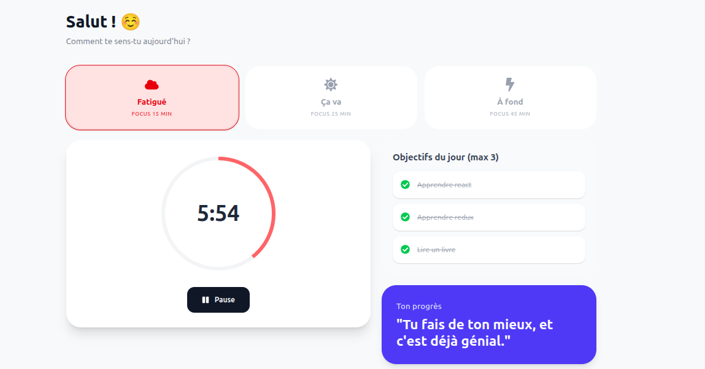

# 🧠 Focus – Study & Focus Manager

Focus est une application **React** conçue pour aider les étudiants (et développeurs débutants) à **retrouver de la concentration sans pression**, même lors des journées de fatigue mentale.

Ce projet met l’accent sur une **productivité bienveillante**, adaptée à l’énergie réelle de l’utilisateur.

---

##  Problème

Beaucoup d’étudiants rencontrent :

* des difficultés de concentration
* une fatigue mentale récurrente
* une perte de motivation
* une tendance à se culpabiliser lorsqu’ils n’arrivent pas à étudier longtemps

Les outils classiques de productivité sont souvent rigides et culpabilisants.

---

##  Solution apportée par FocusFlow

FocusFlow s’adapte **à l’état de l’utilisateur**, et non l’inverse.

L’application permet de :

* choisir son **niveau d’énergie du jour**
* lancer des **sessions de focus adaptées** (15, 25 ou 45 minutes)
* définir **jusqu’à 3 objectifs par jour** pour éviter la surcharge
* visualiser son progrès avec des **messages positifs**

L’objectif n’est pas d’être parfait, mais **d’avancer doucement et durablement**.

---

##  UX & Design choices

* Interface minimaliste et apaisante
* Couleurs douces selon le niveau d’énergie
* Limitation volontaire des objectifs
* Messages encourageants plutôt que des statistiques agressives

Le design est pensé pour **réduire la charge mentale**.

---

##  Aperçu

> *« Tu fais de ton mieux, et c’est déjà génial. »* 💜

---

Merci d’avoir pris le temps de découvrir k'application Focus 🌱
